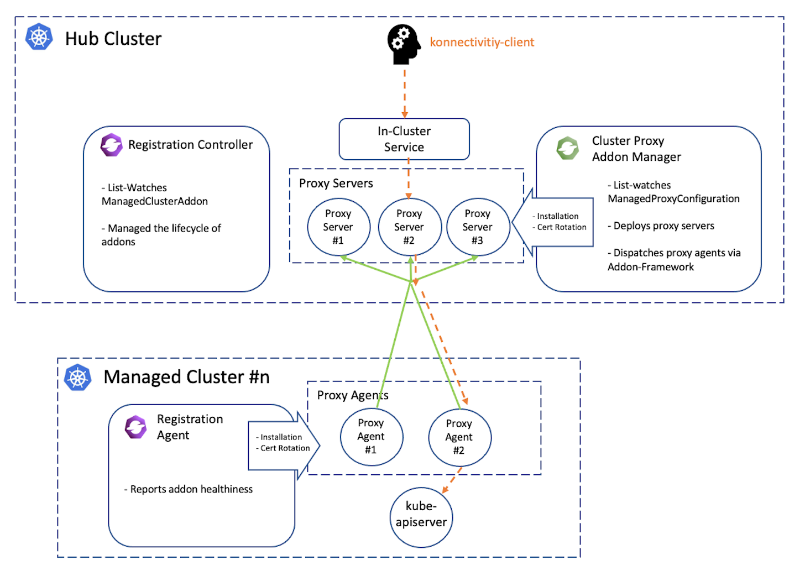

# Cluster Proxy

[](http://www.apache.org/licenses/LICENSE-2.0.html)
[](https://github.com/open-cluster-management-io/cluster-proxy/actions/workflows/go-presubmit.yml)

## Overview

Cluster Proxy enables secure network connectivity between hub clusters and managed clusters in Open Cluster Management (OCM) environments. It provides a solution for accessing services in managed clusters from the hub cluster, even when clusters are deployed in different networks or VPCs.

## What is Cluster Proxy?

Cluster Proxy is a pluggable addon for Open Cluster Management (OCM) built on the extensibility
provided by [addon-framework](https://github.com/open-cluster-management-io/addon-framework) 
that automates the installation of [apiserver-network-proxy](https://github.com/kubernetes-sigs/apiserver-network-proxy)
on both hub cluster and managed clusters. The network proxy establishes
reverse proxy tunnels from the managed cluster to the hub cluster, enabling 
clients from the hub network to access services in the managed clusters'
network even when all the clusters are isolated in different VPCs.

Cluster Proxy consists of two components:

- **Addon-Manager**: Manages the installation of proxy servers (proxy ingress)
  in the hub cluster.
  
- **Addon-Agent**: Manages the installation of proxy agents for each managed 
  cluster.

The overall architecture is shown below:




## Getting started

### Prerequisites

- Open Cluster Management (OCM) registration component (>= 0.5.0)
- A Kubernetes cluster serving as the hub cluster
- One or more managed Kubernetes clusters registered with the hub

### Steps

#### Installing via Helm Chart

1. Add the OCM Helm repository:

```shell
helm repo add ocm https://open-cluster-management.io/helm-charts/
helm repo update
helm search repo ocm/cluster-proxy
```

Expected output:
```
NAME                       	CHART VERSION	APP VERSION	DESCRIPTION                   
ocm/cluster-proxy          	<..>       	    1.0.0      	A Helm chart for Cluster-Proxy
```

2. Install the Helm chart:

```shell
helm install \
    -n open-cluster-management-addon --create-namespace \
    cluster-proxy ocm/cluster-proxy 
```

3. Verify the installation:

```shell
kubectl get pods -n open-cluster-management-addon
```

Expected output:
```
NAME                                           READY   STATUS        RESTARTS   AGE
cluster-proxy-5d8db7ddf4-265tm                 1/1     Running       0          12s
cluster-proxy-addon-manager-778f6d679f-9pndv   1/1     Running       0          33s
...
```

4. The addon will be automatically installed to your registered clusters. 
   Verify the addon installation:

```shell
kubectl get managedclusteraddon -A | grep cluster-proxy
```

Expected output:
```
NAMESPACE         NAME                     AVAILABLE   DEGRADED   PROGRESSING
<your cluster>    cluster-proxy            True                   
```

### Usage

By default, the proxy servers are running in gRPC mode so the proxy clients 
are expected to proxy through the tunnels by the [konnectivity-client](https://github.com/kubernetes-sigs/apiserver-network-proxy#clients).
Konnectivity is the underlying technique of Kubernetes' [egress-selector](https://kubernetes.io/docs/tasks/extend-kubernetes/setup-konnectivity/)
feature and an example of konnectivity client is visible [here](https://github.com/open-cluster-management-io/cluster-proxy/tree/main/examples/test-client).

In code, proxying to the managed cluster is simply a matter of overriding the 
dialer of the Kubernetes client config object, e.g.:

```go
  // instantiate a gRPC proxy dialer
  tunnel, err := konnectivity.CreateSingleUseGrpcTunnel(
      context.TODO(),
      <proxy service>,
      grpc.WithTransportCredentials(grpccredentials.NewTLS(proxyTLSCfg)),
  )
  cfg, err := clientcmd.BuildConfigFromFlags("", kubeconfig)
  if err != nil {
      return err
  }
  // The managed cluster's name.
  cfg.Host = clusterName
  // Override the default TCP dialer
  cfg.Dial = tunnel.DialContext 
```

### Performance

The following table shows network bandwidth benchmarking results via [goben](https://github.com/udhos/goben)
comparing direct connections with connections through Cluster-Proxy (Apiserver-Network-Proxy). 
The proxying through the tunnel involves approximately 50% performance overhead, so it's recommended 
to avoid transferring data-intensive traffic over the proxy when possible.

|  Bandwidth  |   Direct   | over Cluster-Proxy |
|-------------|------------|--------------------|
|  Read/Mbps  |  902 Mbps  |     461 Mbps       |
|  Write/Mbps |  889 Mbps  |     428 Mbps       |


## References

- Design: [https://github.com/open-cluster-management-io/enhancements/tree/main/enhancements/sig-architecture/14-addon-cluster-proxy](https://github.com/open-cluster-management-io/enhancements/tree/main/enhancements/sig-architecture/14-addon-cluster-proxy)
- Addon-Framework: [https://github.com/open-cluster-management-io/addon-framework](https://github.com/open-cluster-management-io/addon-framework)
