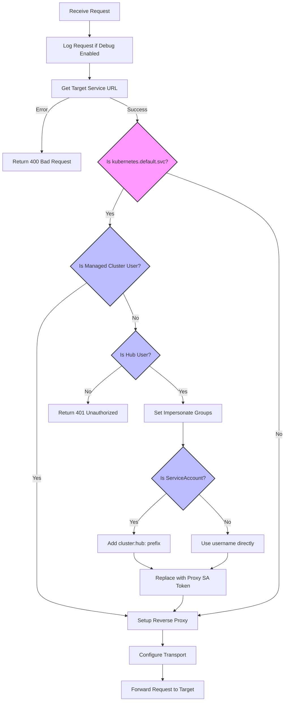

## Requirements

### 1 The Pre-req of using service-proxy impersonation feature

Both hub and managed cluster need to be configured with the same external IDP.

### 2 The corner case of serviceaccount impersonation

If token is a hub serviceaccount token, the impersonate user will be `cluster:hub:system:serviceaccount:<namespace>:<serviceaccount-name>`.

This username should also be the `User` that used in ClusterPermission rolebinding.

For `local-cluster`, the service-proxy will also determine the token as a managed cluster user. So when binding serviceaccount via ClusterPermission on local-cluster, no need to add `cluster:hub:` prefix.

### 3 The flow of how service-proxy handles requests



### 4 How to test service-proxy impersonation feature

Because the current e2e infrastructure doesn't support set up 2 clusters, we need to test this feature manually.

#### 4.1 Configure the LDAP test server to both clusters and create a serviceaccount on the hub cluster

First, make sure you have a hub cluster and at least one managed cluster:

```bash
➜  test git:(master) ✗ oc get managedcluster
NAME            HUB ACCEPTED   MANAGED CLUSTER URLS                                                           JOINED   AVAILABLE   AGE
cluster1        true           https://api.server-foundation-sno-lite-qrpbl.dev04.red-chesterfield.com:6443   True     True        6m39s
local-cluster   true           https://api.server-foundation-sno-lite-7xhwt.dev04.red-chesterfield.com:6443   True     True        7d16h
```

We are going configure the same [LDAP test server](https://www.forumsys.com/2022/05/10/online-ldap-test-server/) for both hub and managed cluster.

```bash
cat << 'EOF' | oc apply -f -
apiVersion: config.openshift.io/v1
kind: OAuth
metadata:
  name: cluster
spec:
  identityProviders:
  - name: ldap-provider
    mappingMethod: claim
    type: LDAP
    ldap:
      attributes:
        id:
        - dn
        email:
        - mail
        name:
        - cn
        preferredUsername:
        - uid
      bindDN: "cn=read-only-admin,dc=example,dc=com"
      bindPassword:
        name: ldap-secret
      insecure: true # Just for test
      url: "ldap://ldap.forumsys.com:389/dc=example,dc=com?uid?sub?(objectClass=inetOrgPerson)"
---
apiVersion: v1
kind: Secret
metadata:
  name: ldap-secret
  namespace: openshift-config
type: Opaque
stringData:
  bindPassword: password
---
apiVersion: v1
kind: ConfigMap
metadata:
  name: ldap-group-sync
  namespace: openshift-config
data:
  sync.yaml: |
    kind: LDAPSyncConfig
    apiVersion: v1
    url: ldap://ldap.forumsys.com:389
    bindDN: "cn=read-only-admin,dc=example,dc=com"
    bindPassword: password
    insecure: true
    rfc2307:
      groupsQuery:
        baseDN: "dc=example,dc=com"
        scope: sub
        derefAliases: never
        filter: "(objectclass=groupOfUniqueNames)"
      groupUIDAttribute: cn
      groupNameAttributes: [ cn ]
      groupMembershipAttributes: [ uniqueMember ]
      usersQuery:
        baseDN: "dc=example,dc=com"
        scope: sub
        derefAliases: never
      userUIDAttribute: dn
      userNameAttributes: [ uid ]
EOF
```

Sync the LDAP groups to the hub cluster:

```bash
oc get configmap ldap-group-sync -n openshift-config -o jsonpath='{.data.sync\.yaml}' > /tmp/ldap-sync.yaml
oc adm groups sync --sync-config=/tmp/ldap-sync.yaml --confirm
rm /tmp/ldap-sync.yaml
```

After this step, you can see the groups in the hub cluster:

```bash
➜  test git:(master) ✗ oc get groups
NAME             USERS
Chemists         curie, boyle, nobel, pasteur
Italians         tesla
Mathematicians   euclid, riemann, euler, gauss, test
Scientists       einstein, tesla, newton, galileo
```

Then, create a serviceaccount on the hub cluster:

```bash
oc create namespace test
oc create serviceaccount test-sa -n test
```

#### 4.2 Create Rolebinding with hub user, group and serviceaccount via ClusterPermission

On the hub cluster, create the ClusterPermission resources:

```bash
cat << 'EOF' | oc apply -f -
apiVersion: rbac.open-cluster-management.io/v1alpha1
kind: ClusterPermission
metadata:
  name: test-pods
  namespace: cluster1
spec:
  roles:
  - namespace: open-cluster-management-agent-addon
    rules:
    - apiGroups: [""]
      resources: ["pods"]
      verbs: ["get","list"]
  roleBindings:
  - namespace: open-cluster-management-agent-addon
    roleRef:
      kind: Role
    subject:
      apiGroup: rbac.authorization.k8s.io
      kind: User
      name: einstein
---
apiVersion: rbac.open-cluster-management.io/v1alpha1
kind: ClusterPermission
metadata:
  name: test-deployments
  namespace: cluster1
spec:
  roles:
  - namespace: open-cluster-management-agent-addon
    rules:
    - apiGroups: ["apps"]
      resources: ["deployments"]
      verbs: ["get","list"]
  roleBindings:
  - namespace: open-cluster-management-agent-addon
    roleRef:
      kind: Role
    subject:
      apiGroup: rbac.authorization.k8s.io
      kind: Group
      name: Scientists
---
apiVersion: rbac.open-cluster-management.io/v1alpha1
kind: ClusterPermission
metadata:
  name: test-services
  namespace: cluster1
spec:
  roles:
  - namespace: open-cluster-management-agent-addon
    rules:
    - apiGroups: [""]
      resources: ["services"]
      verbs: ["get","list"]
  roleBindings:
  - namespace: open-cluster-management-agent-addon
    roleRef:
      kind: Role
    subject:
      apiGroup: rbac.authorization.k8s.io
      kind: User
      name: cluster:hub:system:serviceaccount:test:test-sa
EOF
```

On the managed cluster, check the result by running the following command:

```bash
➜  test git:(master) ✗ oc get role -n open-cluster-management-agent-addon | grep test
test-deployments                                             2025-04-09T09:09:42Z
test-pods                                                    2025-04-09T09:09:42Z
test-services                                                2025-04-09T09:09:43Z
```

```bash
➜  test git:(master) ✗ oc get rolebinding -n open-cluster-management-agent-addon | grep test
test-deployments                                             Role/test-deployments                                             3m26s
test-pods                                                    Role/test-pods                                                    44s
test-services                                                Role/test-services                                                43s
```

#### 4.3 Test the impersonation of User and Group

On the hub cluster, get token of user "einstein":

```bash
oc login -u einstein -p password --insecure-skip-tls-verify=true
TOKEN=$(oc whoami -t)
```

Then, list pods of cluster1 via cluster-proxy-addon endpoint:

```bash
oc config use-context admin
CLUSTER_PROXY_URL=$(oc get route cluster-proxy-addon-user -n multicluster-engine -o jsonpath='{.spec.host}')
curl -k -H "Authorization: Bearer $TOKEN" https://$CLUSTER_PROXY_URL/cluster1/api/v1/namespaces/open-cluster-management-agent-addon/pods
curl -k -H "Authorization: Bearer $TOKEN" https://$CLUSTER_PROXY_URL/cluster1/apis/apps/v1/namespaces/open-cluster-management-agent-addon/deployments
```

Both `curl` commands should return the result successfully.

#### 4.4 Test the impersonation of ServiceAccount

On the hub cluster, get token of serviceaccount "test-sa":

```bash
# For Kubernetes 1.24 and higher:
SA_TOKEN=$(oc create token test-sa -n test)

# For Kubernetes 1.23 and lower:
# 1. Get the secret associated with the serviceaccount
SECRET_NAME=$(oc get serviceaccount test-sa -n test -o jsonpath='{.secrets[0].name}')

# 2. Extract the token from the secret
SA_TOKEN=$(oc get secret $SECRET_NAME -n test -o jsonpath='{.data.token}' | base64 -d)

# Choose the appropriate method based on your Kubernetes version
```

Then, list services of cluster1 via cluster-proxy-addon endpoint:

```bash
curl -k -H "Authorization: Bearer $SA_TOKEN" https://$CLUSTER_PROXY_URL/cluster1/api/v1/namespaces/open-cluster-management-agent-addon/services
```

The command should return the result successfully.
