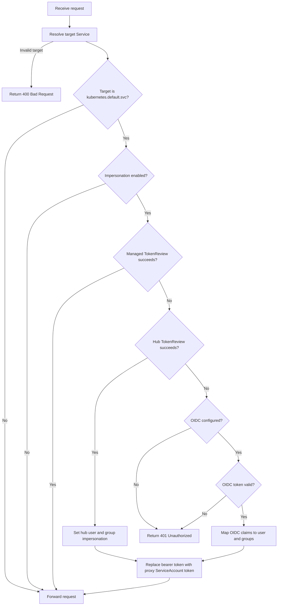

# Service proxy authentication and impersonation

## Overview

When `enableServiceProxy=true`, cluster-proxy deploys a user-server on the hub
and a service-proxy sidecar on each managed cluster. The user-server sends
requests through the cluster-proxy tunnel, and the service-proxy authenticates
requests targeting the managed cluster Kubernetes API.

For Kubernetes API requests, service-proxy tries authentication in this order:

1. Managed cluster TokenReview
2. Hub cluster TokenReview
3. External OIDC ID token verification, when configured

The three paths have different forwarding behavior:

| Authentication path | Forwarded identity |
| --- | --- |
| Managed cluster TokenReview | The original bearer token is forwarded unchanged. |
| Hub cluster TokenReview | The request uses the service-proxy service account token and impersonates the hub username and groups. |
| External OIDC | The request uses the service-proxy service account token and impersonates the mapped OIDC username and groups. |

The hub and managed cluster do **not** need to use the same identity provider.
A hub token only needs to be valid on the hub. The resulting username and
groups need corresponding RBAC on the managed cluster.

Authentication and impersonation are only applied when the target is
`kubernetes.default.svc`. Requests to other proxied Services are forwarded
without this Kubernetes API authentication flow.

### ServiceAccount identities

For a remote managed cluster, a hub ServiceAccount is impersonated as:

```text
cluster:hub:system:serviceaccount:<namespace>:<serviceaccount-name>
```

Use that full username in managed cluster RBAC. On `local-cluster`, the
ServiceAccount token normally succeeds in the managed cluster TokenReview
first, so the `cluster:hub:` prefix is not added.

### Request flow


```mermaid
flowchart TD
    A[Receive request] --> B[Resolve target Service]
    B -->|Invalid target| C[Return 400 Bad Request]
    B --> D{Target is kubernetes.default.svc?}
    D -->|No| P[Forward request]
    D -->|Yes| E{Impersonation enabled?}
    E -->|No| P
    E -->|Yes| F{Managed TokenReview succeeds?}
    F -->|Yes| P
    F -->|No| G{Hub TokenReview succeeds?}
    G -->|Yes| H[Set hub user and group impersonation]
    G -->|No| I{OIDC configured?}
    I -->|No| U[Return 401 Unauthorized]
    I -->|Yes| J{OIDC token valid?}
    J -->|No| U
    J -->|Yes| K[Map OIDC claims to user and groups]
    H --> L[Replace bearer token with proxy ServiceAccount token]
    K --> L
    L --> P
```

## Enable service-proxy

Service-proxy is disabled by default. For a Helm installation, enable the hub
user-server, the managed cluster service-proxy sidecar, and impersonation:

```bash
helm upgrade --install cluster-proxy ./charts/cluster-proxy \
  --namespace open-cluster-management-addon \
  --create-namespace \
  --set enableServiceProxy=true \
  --set enableImpersonation=true \
  --set userServer.enabled=true
```

`userServer.enabled=true` asks the controller to generate and rotate the
user-server serving certificate. If you provide that certificate yourself,
leave this value false and follow the
[user-server certificate instructions](../../charts/cluster-proxy/README.md#user-server-serving-certificate).

## OpenShift LDAP hub-token verification

This procedure verifies user, group, and ServiceAccount impersonation across a
hub and a remote managed cluster. LDAP is only an example hub authentication
provider; service-proxy itself is not LDAP-specific.

The public LDAP server used below is suitable for testing only. Do not use its
shared credentials or insecure LDAP connection in production.
The `curl` examples also skip user-server certificate verification for this
lab procedure. In production, expose the user-server with a trusted
certificate or pass its CA bundle with `--cacert`.

### 1. Set the cluster and namespace variables

Use an administrator context for each cluster:

```bash
export HUB_CONTEXT="hub-admin-context"
export MANAGED_CONTEXT="managed-cluster-admin-context"
export MANAGED_CLUSTER=cluster1
export HUB_ADDON_NAMESPACE=open-cluster-management-addon
export SPOKE_ADDON_NAMESPACE=open-cluster-management-cluster-proxy
```

Replace the example context names with contexts from your kubeconfig.
`HUB_ADDON_NAMESPACE` is the namespace containing the user-server endpoint.
For the Helm installation in this guide it is the release namespace;
MultiClusterEngine-based installations use `multicluster-engine`.
`SPOKE_ADDON_NAMESPACE` must match the managed cluster addon installation
namespace.

Confirm the addon is available:

```bash
oc --context "$HUB_CONTEXT" \
  get managedclusteraddon cluster-proxy \
  --namespace "$MANAGED_CLUSTER"
```

### 2. Configure the LDAP provider on the hub

Create the bind password, group-sync configuration, and OpenShift OAuth
identity provider on the hub only:

```bash
oc --context "$HUB_CONTEXT" apply -f - <<'EOF'
apiVersion: v1
kind: Secret
metadata:
  name: ldap-secret
  namespace: openshift-config
type: Opaque
stringData:
  bindPassword: password
---
apiVersion: v1
kind: ConfigMap
metadata:
  name: ldap-group-sync
  namespace: openshift-config
data:
  sync.yaml: |
    kind: LDAPSyncConfig
    apiVersion: v1
    url: ldap://ldap.forumsys.com:389
    bindDN: "cn=read-only-admin,dc=example,dc=com"
    bindPassword: password
    insecure: true
    rfc2307:
      groupsQuery:
        baseDN: "dc=example,dc=com"
        scope: sub
        derefAliases: never
        filter: "(objectclass=groupOfUniqueNames)"
      groupUIDAttribute: cn
      groupNameAttributes: [cn]
      groupMembershipAttributes: [uniqueMember]
      usersQuery:
        baseDN: "dc=example,dc=com"
        scope: sub
        derefAliases: never
      userUIDAttribute: dn
      userNameAttributes: [uid]
---
apiVersion: config.openshift.io/v1
kind: OAuth
metadata:
  name: cluster
spec:
  identityProviders:
  - name: ldap-provider
    mappingMethod: claim
    type: LDAP
    ldap:
      attributes:
        id: [dn]
        email: [mail]
        name: [cn]
        preferredUsername: [uid]
      bindDN: "cn=read-only-admin,dc=example,dc=com"
      bindPassword:
        name: ldap-secret
      insecure: true
      url: "ldap://ldap.forumsys.com:389/dc=example,dc=com?uid?sub?(objectClass=inetOrgPerson)"
EOF
```

Wait for the hub OAuth server to accept the new configuration:

```bash
oc --context "$HUB_CONTEXT" \
  rollout status deployment/oauth-openshift \
  --namespace openshift-authentication \
  --timeout=5m
```

The managed cluster does not need this LDAP provider for hub-token
impersonation. Configure an identity provider there only if you also want to
test the managed cluster TokenReview path with a managed-cluster-issued token.

### 3. Sync the LDAP groups and create a hub ServiceAccount

```bash
LDAP_SYNC_FILE=$(mktemp)
oc --context "$HUB_CONTEXT" \
  get configmap ldap-group-sync \
  --namespace openshift-config \
  --output jsonpath='{.data.sync\.yaml}' >"$LDAP_SYNC_FILE"
oc --context "$HUB_CONTEXT" adm groups sync \
  --sync-config="$LDAP_SYNC_FILE" \
  --confirm
rm -f "$LDAP_SYNC_FILE"

oc --context "$HUB_CONTEXT" \
  create namespace cluster-proxy-auth-test \
  --dry-run=client \
  --output yaml \
  | oc --context "$HUB_CONTEXT" apply -f -

oc --context "$HUB_CONTEXT" \
  create serviceaccount test-sa \
  --namespace cluster-proxy-auth-test \
  --dry-run=client \
  --output yaml \
  | oc --context "$HUB_CONTEXT" apply -f -
```

Verify that the `Scientists` group contains `einstein`:

```bash
oc --context "$HUB_CONTEXT" get group Scientists
```

Expected output:

```
NAME         USERS
Scientists   einstein, tesla, newton, galileo
```

### 4. Distribute managed cluster RBAC with ClusterPermission

This example assumes the OCM ClusterPermission API is installed on the hub.
Create permissions for the LDAP user, LDAP group, and hub ServiceAccount:

```bash
oc --context "$HUB_CONTEXT" apply -f - <<EOF
apiVersion: rbac.open-cluster-management.io/v1alpha1
kind: ClusterPermission
metadata:
  name: cluster-proxy-test-pods
  namespace: ${MANAGED_CLUSTER}
spec:
  roles:
  - namespace: ${SPOKE_ADDON_NAMESPACE}
    rules:
    - apiGroups: [""]
      resources: ["pods"]
      verbs: ["get", "list"]
  roleBindings:
  - namespace: ${SPOKE_ADDON_NAMESPACE}
    roleRef:
      kind: Role
    subject:
      apiGroup: rbac.authorization.k8s.io
      kind: User
      name: einstein
---
apiVersion: rbac.open-cluster-management.io/v1alpha1
kind: ClusterPermission
metadata:
  name: cluster-proxy-test-deployments
  namespace: ${MANAGED_CLUSTER}
spec:
  roles:
  - namespace: ${SPOKE_ADDON_NAMESPACE}
    rules:
    - apiGroups: ["apps"]
      resources: ["deployments"]
      verbs: ["get", "list"]
  roleBindings:
  - namespace: ${SPOKE_ADDON_NAMESPACE}
    roleRef:
      kind: Role
    subject:
      apiGroup: rbac.authorization.k8s.io
      kind: Group
      name: Scientists
---
apiVersion: rbac.open-cluster-management.io/v1alpha1
kind: ClusterPermission
metadata:
  name: cluster-proxy-test-services
  namespace: ${MANAGED_CLUSTER}
spec:
  roles:
  - namespace: ${SPOKE_ADDON_NAMESPACE}
    rules:
    - apiGroups: [""]
      resources: ["services"]
      verbs: ["get", "list"]
  roleBindings:
  - namespace: ${SPOKE_ADDON_NAMESPACE}
    roleRef:
      kind: Role
    subject:
      apiGroup: rbac.authorization.k8s.io
      kind: User
      name: cluster:hub:system:serviceaccount:cluster-proxy-auth-test:test-sa
EOF
```

Wait for the RoleBindings to appear on the managed cluster:

```bash
oc --context "$MANAGED_CONTEXT" \
  get role,rolebinding \
  --namespace "$SPOKE_ADDON_NAMESPACE" \
  | grep cluster-proxy-test
```

### 5. Verify LDAP user and group impersonation

Obtain a hub token without replacing the administrator context in the main
kubeconfig:

```bash
HUB_API=$(oc --context "$HUB_CONTEXT" whoami --show-server)
LDAP_KUBECONFIG=$(mktemp)
oc login "$HUB_API" \
  --kubeconfig "$LDAP_KUBECONFIG" \
  --username einstein \
  --password password \
  --insecure-skip-tls-verify=true
LDAP_TOKEN=$(oc --kubeconfig "$LDAP_KUBECONFIG" whoami --show-token)
rm -f "$LDAP_KUBECONFIG"
```

For an OpenShift installation that exposes the user-server through a Route:

```bash
CLUSTER_PROXY_HOST=$(oc --context "$HUB_CONTEXT" \
  get route cluster-proxy-addon-user \
  --namespace "$HUB_ADDON_NAMESPACE" \
  --output jsonpath='{.spec.host}')
export CLUSTER_PROXY_URL="https://${CLUSTER_PROXY_HOST}"

curl --fail --insecure \
  --header "Authorization: Bearer ${LDAP_TOKEN}" \
  "${CLUSTER_PROXY_URL}/${MANAGED_CLUSTER}/api/v1/namespaces/${SPOKE_ADDON_NAMESPACE}/pods"

curl --fail --insecure \
  --header "Authorization: Bearer ${LDAP_TOKEN}" \
  "${CLUSTER_PROXY_URL}/${MANAGED_CLUSTER}/apis/apps/v1/namespaces/${SPOKE_ADDON_NAMESPACE}/deployments"
```

Both requests should succeed: the first through the user binding and the
second through the `Scientists` group binding. The Helm chart in this
repository does not create a Route; MultiClusterEngine-based installations do.
Without one, expose the `cluster-proxy-addon-user` Service with the ingress
mechanism used by your platform and use that URL.

### 6. Verify hub ServiceAccount impersonation

```bash
SA_TOKEN=$(oc --context "$HUB_CONTEXT" \
  create token test-sa \
  --namespace cluster-proxy-auth-test)

curl --fail --insecure \
  --header "Authorization: Bearer ${SA_TOKEN}" \
  "${CLUSTER_PROXY_URL}/${MANAGED_CLUSTER}/api/v1/namespaces/${SPOKE_ADDON_NAMESPACE}/services"
```

The request should succeed using the
`cluster:hub:system:serviceaccount:cluster-proxy-auth-test:test-sa` binding.

## OIDC token authentication

Service-proxy can validate an external OIDC ID token without configuring OIDC
on either kube-apiserver and without deploying another authentication proxy.
OIDC is the final fallback after both TokenReviews:

```text
managed cluster TokenReview -> hub TokenReview -> OIDC verification -> impersonation
```

The commands in this section use the following variables. If you did not run
the LDAP procedure above, set them before continuing:

```bash
export HUB_CONTEXT="hub-admin-context"
export MANAGED_CONTEXT="managed-cluster-admin-context"
export MANAGED_CLUSTER=cluster1
export SPOKE_ADDON_NAMESPACE=open-cluster-management-cluster-proxy
export CLUSTER_PROXY_URL="https://user-server.example.com"
```

`CLUSTER_PROXY_URL` is the externally reachable user-server base URL. Include
the scheme and any non-default port, but no trailing slash. Replace the example
contexts and URL with values for your environment.

### OIDC settings

The addon-agent chart exposes the service-proxy OIDC flags as customized
variables:

| AddOnDeploymentConfig variable | Service-proxy flag | Effective default | Description |
| --- | --- | --- | --- |
| `oidcIssuerURL` | `--oidc-issuer-url` | Empty; OIDC disabled | HTTPS issuer URL. Must be set with `oidcClientID`. |
| `oidcClientID` | `--oidc-client-id` | Empty | Required token audience. Must be set with `oidcIssuerURL`. |
| `oidcUsernameClaim` | `--oidc-username-claim` | `sub` | Claim mapped to the Kubernetes username. |
| `oidcUsernamePrefix` | `--oidc-username-prefix` | Issuer URL plus `#` for non-email claims | Explicit username prefix. Set `-` to disable prefixing. |
| `oidcGroupsClaim` | `--oidc-groups-claim` | Empty; no IdP groups | Claim containing a string or array of group names. |
| `oidcGroupsPrefix` | `--oidc-groups-prefix` | Empty | Prefix applied to every mapped group. |
| `oidcReservedNamePrefixes` | `--oidc-reserved-name-prefixes` | `system:` | Comma-separated prefixes forbidden for mapped usernames and groups. |
| `oidcCAConfigMap` | `--oidc-ca-file` | Empty; host root CAs | ConfigMap containing the private issuer CA under `ca.crt`. |
| `oidcSigningAlgs` | `--oidc-signing-algs` | `RS256` | Comma-separated allowed JOSE asymmetric signing algorithms. |
| `oidcRequiredClaimsJSON` | repeated `--oidc-required-claim` | Empty | JSON object whose string key/value pairs must appear in the token. |

The standalone binary exposes the same behavior through its `--oidc-*` flags.
Run `cluster-proxy service-proxy --help` to inspect the CLI defaults.

Important security behavior:

- OIDC requires impersonation. Both the Helm installation and the per-cluster
  addon configuration must leave impersonation enabled.
- The default `system:` reserved prefix prevents an IdP claim from mapping to
  identities such as `system:masters`. A customized list replaces the default,
  so include `system:` when adding prefixes.
- An empty `oidcReservedNamePrefixes` value deliberately disables the reserved
  name check. An empty element inside a non-empty list is rejected.
- `system:authenticated` is appended by service-proxy only after reserved-name
  validation.
- For `oidcUsernameClaim=email`, a present `email_verified` claim must be
  `true`.
- Configure `oidcGroupsPrefix` when external group names could collide with
  existing managed cluster RBAC subjects.
- Issuer discovery and JWKS initialization are lazy. An unavailable issuer
  does not crash-loop service-proxy or affect TokenReview authentication; OIDC
  requests fail until the issuer is available.

### Configure OIDC for one managed cluster

The following hub-side resources configure OIDC only for the selected managed
cluster.

First, if the issuer uses a private CA, create its ConfigMap on the **managed
cluster**:

```bash
kubectl --context "$MANAGED_CONTEXT" \
  create configmap cluster-proxy-oidc-ca \
  --namespace "$SPOKE_ADDON_NAMESPACE" \
  --from-file=ca.crt=/path/to/issuer-ca.crt \
  --dry-run=client \
  --output yaml \
  | kubectl --context "$MANAGED_CONTEXT" apply -f -
```

Omit `oidcCAConfigMap` entirely for an issuer trusted by the container's
standard root CAs.

Create the AddOnDeploymentConfig on the **hub**, in the managed cluster
namespace:

```bash
kubectl --context "$HUB_CONTEXT" apply -f - <<EOF
apiVersion: addon.open-cluster-management.io/v1beta1
kind: AddOnDeploymentConfig
metadata:
  name: oidc-deploy-config
  namespace: ${MANAGED_CLUSTER}
spec:
  customizedVariables:
  - name: enableImpersonation
    value: "true"
  - name: oidcIssuerURL
    value: https://dex.example.com:5556/dex
  - name: oidcClientID
    value: cluster-proxy
  - name: oidcUsernameClaim
    value: email
  - name: oidcUsernamePrefix
    value: "oidc:"
  - name: oidcGroupsClaim
    value: groups
  - name: oidcGroupsPrefix
    value: "oidc:"
  - name: oidcReservedNamePrefixes
    value: "system:,dev:"
  - name: oidcSigningAlgs
    value: RS256
  - name: oidcRequiredClaimsJSON
    value: '{"hd":"example.com","tenant":"tenant-id"}'
  - name: oidcCAConfigMap
    value: cluster-proxy-oidc-ca
EOF
```

`customizedVariables` are strings. Use comma-separated strings for the two
list-valued settings, `oidcReservedNamePrefixes` and `oidcSigningAlgs`.
`oidcRequiredClaimsJSON` must be a JSON object whose values are strings.

Add the deployment config to the existing
`ManagedClusterAddOn.spec.configs` list. Preserve any entries already present:

```bash
kubectl --context "$HUB_CONTEXT" \
  edit managedclusteraddon cluster-proxy \
  --namespace "$MANAGED_CLUSTER"
```

Add:

```yaml
spec:
  configs:
  - group: addon.open-cluster-management.io
    resource: addondeploymentconfigs
    namespace: cluster1
    name: oidc-deploy-config
```

The `namespace` field is the managed cluster name, `cluster1` in this guide.

`status.configReferences` is controller-owned status and must not be edited.
Only clusters whose ManagedClusterAddOn references this configuration receive
the OIDC fallback.

Verify that the reference was accepted and the service-proxy rollout contains
the OIDC flags:

```bash
kubectl --context "$HUB_CONTEXT" \
  get managedclusteraddon cluster-proxy \
  --namespace "$MANAGED_CLUSTER" \
  --output yaml

kubectl --context "$MANAGED_CONTEXT" \
  get deployment cluster-proxy-proxy-agent \
  --namespace "$SPOKE_ADDON_NAMESPACE" \
  --output jsonpath='{.spec.template.spec.containers[?(@.name=="service-proxy")].args}' \
  | tr ' ' '\n' \
  | grep oidc
```

### Grant and verify OIDC RBAC

Bind managed cluster RBAC to the final, prefixed username:

```bash
kubectl --context "$MANAGED_CONTEXT" apply -f - <<EOF
apiVersion: rbac.authorization.k8s.io/v1
kind: Role
metadata:
  name: oidc-pod-reader
  namespace: ${SPOKE_ADDON_NAMESPACE}
rules:
- apiGroups: [""]
  resources: ["pods"]
  verbs: ["get", "list"]
---
apiVersion: rbac.authorization.k8s.io/v1
kind: RoleBinding
metadata:
  name: oidc-pod-reader
  namespace: ${SPOKE_ADDON_NAMESPACE}
roleRef:
  apiGroup: rbac.authorization.k8s.io
  kind: Role
  name: oidc-pod-reader
subjects:
- apiGroup: rbac.authorization.k8s.io
  kind: User
  name: oidc:admin@example.com
EOF
```

Obtain an ID token from the configured provider, then send it to the
user-server:

```bash
export OIDC_TOKEN="replace-with-oidc-id-token"

curl --fail --insecure \
  --header "Authorization: Bearer ${OIDC_TOKEN}" \
  "${CLUSTER_PROXY_URL}/${MANAGED_CLUSTER}/api/v1/namespaces/${SPOKE_ADDON_NAMESPACE}/pods"
```

The `--insecure` option is appropriate only for a lab endpoint. Omit it for a
publicly trusted certificate, or replace it with
`--cacert /path/to/user-server-ca.crt`.

### OIDC CA lifecycle

The `oidcCAConfigMap` volume is optional so the Pod can start before the
ConfigMap exists. When the value is configured, a valid `ca.crt` must be
available before an OIDC request can initialize the authenticator. If the
first request arrives too early, it fails without affecting the TokenReview
paths; a later request can initialize successfully after the ConfigMap is
created. No Pod restart is required.

### Automated coverage

Run the Dex-backed end-to-end test with:

```bash
make test-e2e LABEL_FILTER=oidc
```

The test obtains a real Dex ID token and verifies the complete path:

```text
user-server -> tunnel -> service-proxy -> OIDC verification
  -> impersonation -> managed kube-apiserver
```

It also verifies the impersonated identity, denial before RBAC is granted, and
successful authorization after the matching RoleBinding is created.
